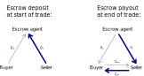
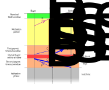

## Three-Party Lightning Escrow Trade Protocol

### Introduction

In the last part of https://github.com/bisq-network/proposals/issues/312, a lightning-based trade protocol was outlined
that used _garbled circuits_ and a third party (escrow agent) to hold the traders' BTC escrow in a way that is arguably
non-custodial, with similar security properties to Bisq's current on-chain escrow protocol, which we attempt to abstract
below. Unfortunately, the proposal didn't go into too much detail as it was focused on a different, much harder to
implement, bond-based BSQ lightning trade protocol idea.

In this proposal, the garbled circuit-based idea is explained in much more detail (with some changes to exactly how the
payment secrets are set up). In particular, there are quite a lot of subtleties during the startup and closure of the
trade that weren't considered properly at the time of the original proposal, but have now been worked out.

### Intended escrow trade security properties

In any arbitrator-backed (i.e. non-MAD) escrow-based trade protocol (with a buyer and seller each supplying a security
deposit on top of the trade amount), there is an implicit third party who takes full custody of the escrow in the event
of a dispute which cannot be resolved through mediation. This is taken to be a high trust role covered by a considerable
bond. The following is an attempt to enumerate the monetary security properties we hope to achieve between the three
parties:

1. **2-out-of-3**

   No party should be able to unilaterally steal or withhold funds belonging to the other two parties (except possibly
   the trade/network fees).

2. **Non-custodial**

   In the case of the third party, the above should hold true without needing to hold them liable against their bond or
   needing any other intervention by the DAO (implicit fourth party). Thus mutually cooperating traders who follow the
   protocol can unconditionally recover their funds.

3. **Safe for the third party**

   The traders cannot collude to steal or withhold funds from the third party (say by taking payout without actually
   depositing the escrow).

4. **Accountable**

   Signatures and receipts of payment are valid (unforgeable), so that in the event that the trade does not close
   normally, the third party can be safely held liable (against their bond) for any and all funds that may be owed to a
   trader or to the DAO. In particular, a situation should not arise where a trader has misbehaved (say the seller) and
   funds may be owed to the counterparty (the buyer) depending on whether the third party has them, but it is impossible
   to tell whether they colluded with the seller to forge receipt of payout or it was actually the buyer colluding with
   the seller to take the payout but then deny it, placing one person's word against the other (buyer vs. third party).

5. **Avalanche free**

   It should not be possible for the third party (colluding with a series of corrupt traders or sweeping the offer book
   using buyer/seller sockpuppets) to steal an arbitrarily large amount of money from a fixed-size starting collateral,
   say by driving a series of trades into arbitration. To ensure this, each trader needs to force the other two parties
   to tie up a total amount of liquidity which exceeds the monies already paid to them (by some large positive amount,
   say the security deposit), at all points in time throughout the trade window (that is, unless the trade closes
   normally). That way, an attacker will steadily use up their liquidity as they sweep the offer book and won't be able
   to free any of it up again until a noticeable amount of trades has gone into dispute, causing all trading to be shut
   down. Without this protection, they could quickly free up the initially 'invested' collateral to repeat their attack
   over and over in a (linearly or exponentially growing) avalanche.

   So with a 15% security deposit (for example), a corrupt third party sweeping the offer book could steal 1.15 / 0.15 ~
   = 7.67 times their starting collateral per round of attacks, but they would get shut down after the first round. In
   this way, if they started with $130,000 they could steal around $1 million, which would probably exceed any
   reasonable bond but still be less than the 10's of millions of dollars that could feasibly be in the offer book, and
   hopefully a recoverable loss for the DAO.

The current on-chain 2-2 multisig mediator-based trade protocol in Bisq 1 enjoys all above five security properties,
with the Burning Man (donation address holder) implicitly taking the role of the third party. The old arbitrator-based
2-3 multisig protocol (with the arbitrator taking the role of the third party) enjoys properties 1-4 but not 5, since
the arbitrator in collusion with one of the traders could make off with the funds right at the start of the trade. Thus
the newer on-chain protocol has strictly better security.

The lightning escrow protocol described here aims to achieve all five security properties (though with a minor flaw
concerning property 4, explained below), with the escrow agent as the third party.

### Overview of the lightning escrow protocol

The buyer, seller and escrow agent each have their own lightning node and wallet. After initial exchange of data between
the three parties at the very start of the trade, a series of six pending lightning payments are set up between their
nodes, bidirectionally between each pair of nodes (thus forming a complete directed graph). The two lightning payments
to the escrow agent are then finalised to open the trade. The buyer then starts their counter-currency (fiat or altcoin)
payment and confirms it in the UI. The seller then closes the trade and releases the escrow by finalising (in
cooperation with the buyer) the remaining four lightning payments.

Let _t_ be the trade amount and _s_ the security deposit (same for both traders) and suppose that the buyer and seller
deposits include their respective trade fees _fB_ and _fS_. Then we have the following lightning
payments:

1. _DB_ = buyer deposit; **size**(_DB_) = _s_ + _fB_;
2. _DS_ = seller deposit; **size**(_DS_) = _t_ + _s_ + _fS_;
3. _PB_ = buyer payout; **size**(_PB_) = _s_;
4. _PS_ = seller payout; **size**(_PS_) = _t_ + _s_;
5. _CBS_ = buyer-seller cross-payment; **size**(_CBS_) = _s_;
6. _CSB_ = seller-buyer cross-payment; **size**(_CSB_) = _t_ + _s_;

These are illustrated as follows:

Why include the cross-payments _CBS_ and _CSB_ instead of just sending payout of the correct
amount directly to the two traders? This is so that each trader has the full escrow amount in pending payments to them
while the trade is open, in order to 'grief' (that is, tie up the channel liquidity of) the other two nodes, who could
be colluding. (Regrettably, it also ties up the channel liquidity of all the routing nodes along each payment path by
the same amount while the trade is open, which could be considered abusive if the trade is open a long time.)

Note that a lightning peer cannot really trust anything seen to happen outside his own node and attached channels (as it
could all be fake/sockpuppets). Thus payments other than those going directly to/from a given peer are irrelevant to
him. 'Griefing' the other two parties in this way (that is, with incoming pending payments) ensures that Security
Property 5 above (avalanche freedom) holds. Tying up the full escrow amount for both the buyer's _and_ the seller's two
counterparties ensures that they are 'down' by at least the security deposit at all points throughout the trade, even
when they collude and fake their mutual payments, as needed for property 5 to hold.

### Payment latches and garbled circuits

To recap payments in lightning: the usual way to make a payment between two nodes is that the recipient first chooses a
secret 256-bit preimage _x_ and gives an invoice to the sender containing the payment hash _h_ = **sha256**(_x_). The
sender then finds a route of channels with sufficient outgoing capacity and sets up a chain of _hash time locked
contracts_ (HTLCs) in those channels, to establish a pending payment to the recipient which he may finalise with the
hash-lock key _x_. The HTLCs have staggered timeouts, timing out first at the recipient end (after perhaps hours to
days) and last at the sender end (after perhaps a few days to a week or so). The recipient has until the initial HTLC
timeout (really some hours beforehand and not at the last minute, for security) to finalise his payment or let it time
out. When finalising, the payment preimage _x_ propagates (usually instantly but theoretically much slower) back to the
sender, where it serves as a receipt. The sender need wait no longer than the final HTLC expiry to get the receipt.

In our lightning escrow protocol, each trader makes a pending deposit _D_ (_DB_ or _DS_ as defined
above) to the escrow agent, who reciprocates with a pending payout _P_ (_PB_ or _PS_) of almost
the same amount back to the trader. The payment _D_ is then finalised, leaving the trader with a receipt. If these
payments are set up in the usual way, with a recipient-generated preimage and hash, then this creates the obvious
problem of "who goes first?". If the escrow agent goes first then Security Property 3 above (safety for the third party)
is violated, since the trader can finalise and run off with the payout. OTOH if the trader goes first then Security
Property 2 (non-custodiality) is technically violated and, in the case of the seller, Security Property 5 (avalanche
freedom) is violated, since if the escrow agent finalises _DS_ before setting up _PS_
then the pending payments to the seller are too small to 'grief' the counterparties sufficiently.

To solve this problem, we need a way to set up a payment with a sender-controlled latch, such that the recipient cannot
finalise the payment until the latch is released, but when they do the sender is still left with a valid receipt (that
is, one that cannot be forged by them). In the case of the payments _D_ and _P_ above, there should either be a latch
on _D_ or on _P_ (it doesn't matter which), and it should be automatically released when the counter-payment is
finalised (plus the latched payment should have a bigger timeout than its unlatched counter-payment). That way, there is
no danger provided the latched payment is set up first. Then when both the payments are set up, the latch can be
released and escrow agent can finalise _D_ to start the trade.

To create such a _latched payment with valid receipt_, the payment hash must be derived from both a sender secret _L_
and recipient secret _R_, with the former serving as the latch key and the latter serving as the receipt. The secrets
should be combined in some way to form the payment preimage, say by XORing them:
> payment hash := **sha256**(_L_ **xor** _S_), for 256-bit secrets _L_ and _S_;

or by concatenating them:
> payment hash := **sha256**(_L_ || _S_), for 128-bit secrets _L_ and _S_.

This requires a generic [secure 2-party computation](https://en.wikipedia.org/wiki/Secure_two-party_computation) (2PC),
to jointly compute the (public) payment hash without either party sharing their secret. We may use a
[garbled circuit](https://en.wikipedia.org/wiki/Garbled_circuit) to perform such a computation, together with an
[oblivious transfer](https://en.wikipedia.org/wiki/Oblivious_transfer) (the easy part) of the garbled input bits to the
counterparty.

Garbled circuits provides a way to encrypt a boolean circuit evaluation by replacing each wire (intermediate bit)
and each gate with a _garbled_ version. For every wire in the circuit, we choose a garbled-1 and a garbled-0. Every
garbled circuit has a _generator_ who performs the garbling, and an _evaluator_ who runs the circuit on the garbled
intermediate bits without learning their ungarbled values (that is, whether a given intermediate bit is a garbled-1 or a
garbled-0). Since the evaluator could tell the difference between the two if they saw multiple combinations of garbled
inputs and outputs of a given gate (say an AND gate), it is vital that the generated circuit is only evaluated once,
just like a one-time pad or a key pair for a [Lamport](https://en.wikipedia.org/wiki/Lamport_signature) signature, and
_never_ reused with a different set of inputs.

So that the evaluator may choose some inputs to the circuit, a 1-out-of-2 oblivious transfer of the evaluator's choice
of garbled-0 or garbled-1 is made from the generator to the evaluator for every secret input bit to the computation that
the evaluator supplies. That way both parties may supply secrets to the computation (with the generator's possibly baked
into the circuit), with neither side learning the other's secrets. At the end of the computation, the evaluator may pass
the final garbled outputs to the generator to check and ungarble them, or the circuit evaluation may directly produce a
set of final ungarbled outputs.

There are a number of optimisations that may be performed to minimise the size of the serialised garbled circuit that is
sent to the evaluator, for a given boolean circuit and number of bits of security. I have written a Java-based garbled
circuit implementation based on [this paper](https://eprint.iacr.org/2014/756.pdf), which shows how to achieve the
optimal size of twice the number of bits of security times the number of AND/OR/NAND/NOR gates in the circuit, with free
XOR/XNOR/NOT gates. In our case, we must perform a garbled SHA-256 hash of a 256-bit preimage. This requires around
21489 AND gates (plus a much larger number of free XOR and NOT gates). For 128 bits of security, this gives a garbled
circuit size of 687648 bytes, which may be generated and evaluated in a fraction of a second. Thus the generator must
send roughly 2/3 MB to the evaluator for every lightning payment latch that needs to be set up, with a corresponding
secure 2-party SHA-256 computation. (Note that the oblivious transfers use negligible bandwidth in comparison.)

In our protocol, we distinguish between _hard latched_ payments, where the latch key is known only by the sender for
maximum security, and _soft latched_ payments, where the latch key is passed to the sender from a third party who
actually runs the secure 2PC with the recipient. In particular, we give the buyer a soft latch key supplied by the
escrow agent for a noncritical purpose, to avoid having to run a secure 2PC directly between the buyer and the seller
(or even a secure 3PC between all three parties, which would be hugely expensive).

### Broadcasting with a backup notary

To ensure Security Property 4 above (accountability), there are a couple of points in the protocol where it is necessary
for a party to announce or reveal something to the other two parties before a given time (really block height), such
that it cannot later be denied that the other parties received that message on time, nor can it be falsely claimed that
the message was sent on time when it wasn't. In particular, the trade must either close cleanly or go into arbitration
and in the former case, all four pending payments _PB_, _PS_, _CBS_ and
_CSB_ must finalise before any of them have a chance to time out. This requires the escrow agent to announce
their receipt of the payment preimage of _PS_ on time, officially closing the trade, before the payments
_PB_ and _CSB_ to the buyer time out, as the buyer will need the seller's preimage to finalise
them. Otherwise, the escrow agent could be held liable for any payouts not received.

We shall call such a non-repudiable announcement before a given block height a _broadcast_. In the happy path, this can
be implemented by merely receiving an ACK from the other two parties upon sending each a message, non-repudiably
acknowledging receipt of the message on time. However, a malicious party could withhold their ACK. In that case, it is
necessary to send the message to a backup notary. This could simply be a timestamped broadcast to the Bisq P2P network,
or for greater security we may use the Bitcoin blockchain as the notary, with confirmation of an `OP_RETURN` with the
relevant message before the cutoff block height.

### Payment timeouts

There are six time windows of import to our lightning escrow protocol, as follows:

1. Nominal trade window (1-4 days);
2. Mediation period (5-10 days minus nominal trade period);
3. Timeout of payments _PS_ and _CBS_ (hours to days);
4. Crucial buyer online window (say 24 hours);
5. Timeout of payments _PB_ and _CSB_ (hours to days);
6. Arbitration period (indefinite).

Additionally, there are the timeout windows of the deposits _DB_ and _DS_, which may occur any
time wholly before and after the boundary 3-4 respectively (but before window 6, the arbitration period). Of course,
those payments would normally finalise quickly right at the start of the trade, at which point their timeouts cease to
be relevant.

These events are illustrated as follows:

Note that the arrows show when the six lightning payments are set to time out, not when they actually finalise in
practice, which should usually be well within the nominal trade window. The arrows run backwards in time, reflecting the
fact that lightning payments time out first at the recipient end, with the HTLC timeouts working backwards to the
sender.

The trade may close normally any time up to the end of the mediation period, before the lightning payment timeouts
start. Just like in the present on-chain escrow protocol, the buyer and seller only need to be online simultaneously at
the start of the trade. The buyer confirms fiat/altcoin payment while the seller is possibly offline, then the seller
confirms receipt and closes the trade to release the funds while the buyer is possibly offline. To close the trade in
this protocol, the seller first releases his funds by finalising _PS_ and _CBS_, which he may do
while the buyer is offline. This completes the trade for the seller, who now has no need to be online again. Then the
next time the buyer comes online, he sees the broadcast preimage of _PS_, which serves as a key to unlock the
payments _PB_ and _CSB_ (that is, it is used to derive their payment preimages). Finalising those
payments completes the trade for the buyer.

The 24-hour crucial buyer online window is only of relevance in the event that it is getting near the end of the
mediation period and the seller still hasn't released. Then the buyer must make sure he is online at some point in that
window of block heights in case the seller releases at the last minute. If the buyer does not see the receipt of
_PS_ (sent directly by the seller or broadcast by the escrow agent) from the start of that time window, the
trade is guaranteed to go into arbitration. Otherwise, the buyer has until the end of that time window to finalise his
payments. If he does not, then he is highly likely to lose money and neither of the other parties can be held liable.

### Payment secrets and hashes

To set up all the required payments at the start of the trade, the escrow agent first runs a single secure 2-party
computation with the seller, using a garbled circuit generated in advance by the escrow agent. The parties begin with
the following secrets, generated at random:

* The escrow agent has 32-byte secrets _EB_ and _ER_, plus a 16-byte secret _ES_;
* The seller has 16-byte secrets _S1_ and _S2_;
* The buyer holds no payment related secrets of his own.

Now let _S_ = _S1_ || _S2_ (a 32-byte secret). Then we set the following payment preimages:

1. **preimage**(_DB_) = _EB_ (unlatched payment);
2. **preimage**(_DS_) = _S1_ || _ES_ (hard latched payment, latch key _S1_);
3. **preimage**(_PB_) = _S_ **xor** _ER_ **xor** _EB_ (hard latched payment, latch
   key _EB_);
4. **preimage**(_PS_) = _S_ **xor** _ER_ (soft latched payment, latch key _ER_);
5. **preimage**(_CBS_) = _S_ **xor** _ER_ **xor** _EB_ (hard latched payment, latch
   key _EB_);
6. **preimage**(_CSB_) = _S_ **xor** _ER_ (soft latched payment, latch key _ER_);

The escrow agent shares _ER_ with the buyer at the very start of the trade, serving as a soft latch key for
the buyer. This is to prevent the seller from prematurely releasing the escrow before the buyer has started payment. The
secrets _S1_ and _EB_ serve as hard latch keys for the seller and escrow agent respectively, to
prevent any of the parties from running off with money at the start of the trade. The secrets _EB_ (latch
key), _ES_ and _S2_ serve as receipts of payment of the deposits _DB_, _DS_
and the combined final payouts, respectively.

Thus there are four distinct payment preimages / hashes, with _PB_ and _CBS_ sharing the same hash
and _PS_ and _CSB_ sharing the same hash. So the garbled circuit / secure 2PC between the seller
and the escrow agent needs to compute the following three values:
> **sha256**(_S1_ || _ES_); 
> **sha256**(_S_ **xor** _ER_); 
> **sha256**(_S_ **xor** _ER_ **xor** _EB_).

This gives a garbled circuit size of roughly 2/3 + 2/3 + 2/3 = 2 MB.

At the end of the circuit evaluation by the seller, he is left with a list of 768 garbled bits which form the three
256-bit values above. These need to be sent to the escrow agent (circuit generator) so that each can be checked to be a
valid garbling and ungarbled. That way, the escrow agent knows that the three hashes really are linked in the above way
and not just made up by the seller. This is important for security.

### Precomputation of the garbled circuits

For each trade, the escrow agent supplies a single garbled circuit to the seller with preset and possibly baked-in
secrets _EB_, _ER_ and _ES_. Just as it is important that the seller can assure the
escrow agent that the circuit evaluation wasn't tampered with (by letting the escrow agent see the garbled outputs), it
is also important that the escrow agent cannot generate a broken garbled circuit, say to deliberately produce the wrong
hashes or leak secrets in its outputs. The escrow agent needs to supply some kind of proof to _both_ traders that the
circuit was generated correctly. So that it doesn't leak the escrow agent's secrets, the proof should be zero-knowledge.

As a complete [zero-knowledge proof](https://en.wikipedia.org/wiki/Zero-knowledge_proof) (ZKP) of correct circuit
generation, such as
a [zk-SNARK](https://blog.coinfabrik.com/wp-content/uploads/2017/03/zkSNARK-explained_basic_principles.pdf)
or [zk-STARK](https://eprint.iacr.org/2018/046.pdf), would be an extremely complex and heavyweight construction, we
shall settle for a probabilistic proof, based on sampling a large number of pre-committed candidate garbled circuits and
then using one of the unsampled ones - a sort-of poor man's zero-knowledge proof.

This could work in detail as follows. The escrow agent chooses, say, a million secret random seeds
_x1_,...,_x1000000_. From each seed _xi_, the escrow agent _deterministically_
generates the secrets _EBi_, _ERi_ and _ESi_ as above, together with a garbled
circuit _Gi_ in which they are embedded. Then the escrow agent forms a Merkle tree out of the million
pairs (**hash**(_xi_), _Gi_), for any suitable cryptographic hash function, such as SHA-256. At
the root of the Merkle tree is a hash _x_ which the escrow agent proceeds to publish, committing him to all the circuits
and secrets underneath. This whole private computation should take the escrow agent no more than a few days.

Now a random shuffling _P_ of the million indices (Merkle tree leaves) needs to be chosen, _after_ the root _x_ is
published, in a way that the escrow agent has demonstrably no control over. That is, he provably cannot bias the
shuffling in any way. This could be achieved by using an unbiased output from a random beacon of some sort, such as
taking the Bitcoin block hash at some predetermined future height, then hashing it over and over a very large fixed
number of times (taking hours, say) to produce a final 256-bit random key _k_. Then it is provably the case that no one
can bias _k_ in any way, not even a single bit, except at extreme cost. We may then use
a [format-preserving encryption](https://en.wikipedia.org/wiki/Format-preserving_encryption) (FPE) scheme, setting the
permutation _P_ to be the encryption of a Merkle leaf index with key _k_.

Having determined the shuffling _P_, the escrow agent reveals the last half of the list of shuffled secret seeds,
_xP(500001)_,...,_xP(1000000)_, together with paths from the public root _x_ to each of the
corresponding Merkle leaves. Then it may be independently verified that the escrow agent generated each circuit
_GP(500001)_,...,_GP(1000000)_ correctly, by regenerating it (together with its baked-in secrets)
from the corresponding seed and checking that it matches byte-for-byte. If a single bad circuit is found, then the
escrow agent forfeits his bond.

Having sampled half the circuits at random in this way, the escrow agent can only hide a handful of bad circuits amongst
the unused ones without getting caught and has far higher expected loss from his gambled bond than expected financial
gain, no matter how many bad circuits he attempts to sneak in.

For each trade, the escrow agent chooses a fresh index _i_ from the first 500000 shuffled indices _P(1)_,...,_P(500000)_
and sends the seller the garbled circuit _Gi_ together with its path from the Merkle root _x_, so that the
two traders can be reasonably sure that it is good. This allows up to 500000 trades to be completed before the escrow
agent runs out of garbled circuits and the setup above has to be repeated, which should take quite a while.

### Payment setup and deposit finalisation

Having run a secure 2PC between the seller and the escrow agent to compute the hashes of the six lightning payments, the
next step is to route and set up all the HTLCs before finalising any of the pending payments. The order in which the
payments are made is important, in case of any misbehaviour by a party half-way through. In particular, the buyer
deposit _DB_ is unlatched and the seller-routed payout _PS_ is only soft latched, so they need to
be made _after_ the respective reciprocal payments _PB_ and _DS_, as discussed when introducing
payment latches. The order of events at the start of the trade is as follows:

1. The seller chooses secrets _S1_ and _S2_ and evaluates a 2 MB garbled circuit precomputed by
   the escrow agent (sent either at the start of the trade or cached in advance by the seller), sharing the resultant
   payment hashes (as verified by the escrow agent) with the other two parties. The escrow agent also shares the soft
   latch key  _ER_ with the buyer (only).
2. The seller sets up pending payments _DS_ and _CSB_.
3. The escrow agent sets up pending payments _PB_ and _PS_ (after seeing _DS_).
4. The buyer sets up pending payments _DB_ and _CBS_, but only after the seller has confirmed
   seeing _PS_ to the buyer (and of course the buyer has seen _PB_).
5. The buyer and escrow agent send a signed "go ahead" signal to the seller, who broadcasts the two signatures together
   with the hard latch key _S1_, which serves as the seller's signed "go ahead" signal. The broadcast triple
   of signatures has a time limit set to several hours into the trade. This serves a non-repudiable confirmation by all
   the parties that everything has been set up correctly to finalise the deposits and start trading.
6. The escrow agent, upon seeing the seller's broadcast, himself broadcasts the pair of deposit receipts
   (_EB_, _ES_), with time limit set to several hours after the seller's broadcast. The escrow
   agent also finalises the deposits _DB_ and _DS_.

The main purpose of the two broadcasts above is to prevent the escrow agent from maliciously delaying the deposit
finalisation to prevent a clean start to the trade (say in the hope of encouraging payout timeouts to steal money), then
denying it afterwards. The final broadcast serves as an official opening of the trade, which the escrow agent must make
on time to avoid a financial penalty. This ensures that the trade opens in a timely manner and the buyer can begin
payment with a delay no later than a few hours, in the worst case.

Note that the seller deposit _DS_ (but not the smaller buyer deposit) is hard latched and made first, before
the escrow agent makes any payments. This serves as DoS attack protection. We could have designed the protocol so that
both the escrow agent's payouts were hard latched and made first instead, but then malicious traders could run off at
that point, repeating the process to tie up arbitrarily large amounts of the escrow agent's liquidity in incoming
lightning payments without using up any of their own liquidity (just their much cheaper incoming channel capacity).

### Confirming fiat payment and closing the trade

Once the buyer has started the fiat or altcoin payment, he confirms this to the seller and sends the soft latch key
_ER_, which unlatches the remaining four lightning payouts and allows the seller to release. As mentioned
earlier, the seller can be offline at this time.

Upon closing the trade, the seller finalises _PS_ and _CBS_, which reveals the final secret
_S2_ (seller receipt and release key for the payments to the buyer) to the other two parties. The escrow
agent broadcasts _S2_ with time limit set to just before the 24-hour crucial buyer online window after the
mediation period. In practice, this means that the escrow agent doesn't normally need to do anything, since he won't
need to turn to the backup notary until that timeout approaches, by which time the trade should have long since closed.
Then the next time the buyer comes online, he sees _S2_ and uses that to finalise his incoming payments
_PB_ and _CSB_ and sends a non-repudiable confirmation to the escrow agent that the trade closed
normally, completing the trade.

The ability of the escrow agent to produce the seller receipt _S2_ determines whether the trade closed
normally or went into arbitration, that is whether the seller released the escrow or let the payouts time out. There are
three possible scenarios once the arbitration phase is entered:

1. The escrow agent broadcasts _S2_ on time;
2. The escrow agent has _S2_ but did not broadcast it on time;
3. The escrow agent does not have _S2_.

In scenario 1, the trade is assumed to have closed normally and the escrow agent is not liable for any funds.

In scenario 3, the trade went into arbitration and the escrow agent is liable for the full escrow amount, which he must
pass to an arbitrator or to the DAO (say by buying BSQ with it and burning it).

In scenario 2, there was misbehaviour by the seller in collusion with either the buyer or the escrow agent, but it is
impossible to tell which. Therefore, the seller is owed nothing and the buyer is owed some amount up to the full escrow
amount. However, we can only be certain the payment _PS_ from the escrow agent timed out (otherwise he would
have been able to broadcast _S2_ on time). So we can only hold the escrow agent liable for the full escrow
amount _minus_ the security deposit. This means the buyer will get his normal payout, but we cannot award him any of the
seller's forfeited security deposit. Collusion between the seller and a corrupt escrow agent (who could manually pay
back the seller his forfeited security deposit) therefore allows the seller to potentially avoid making a penalty
payment in the case of deliberate misbehaviour (such as claiming buyer never made payment when he did). _This is a minor
flaw in the implementation of Security Property 4 (accountability), as mentioned in the beginning._

Note that we could have designed the trade protocol to furnish the escrow agent with a _buyer_ receipt instead, when
closing the trade. That would have lead to similar three scenarios above, but in the middle scenario we would have
misbehaviour by the _buyer_ in collusion with an unknown second party. That would lead to an inability to award the
seller any of the buyer's forfeited security deposit (who would have it returned by a corrupt escrow agent), which is a
strictly worse situation than the above, as it fails to deter future trading (the most common scam on Bisq). (Arguably
it is theft, as the buyer got a free option from the seller, which should have been taken out of his security deposit.)

(Furnishing the escrow agent with both a buyer and seller receipt appears to be technically very difficult.)

### A note concerning privacy

Lightning payments are onion routed, which means that in principle a sender node, recipient node or intermediate node do
not need to know the entire route (including its endpoints), only their immediate neighbours in the route. Only the
party responsible for finding a route through the network needs to know both the sender and recipient node IDs. In
practice that is always the sender, e.g. when fulfilling an invoice created by the recipient (in which he specifies his
node ID).

Naively, the three parties in our protocol would all share their node IDs with each other, with the sender of each
lightning payment responsible for finding the route. But that would be rather bad for privacy, as the node ID is static
and reused between different payments. In particular, we don't want the escrow agent to harvest the node IDs of all the
traders in the network and work out who is trading with whom.

To provide better privacy, we could try to make the seller find all six routes, passing public key encrypted routing
onions to the other two parties to actually make the payments. This matches the privacy expectations of a regular
lightning payment with an invoice, from the BTC seller to the buyer, with the sender learning the recipient's node ID,
but not the other way round.

Note that according to
the [Onion Routing Protocol](https://github.com/lightning/bolts/blob/master/04-onion-routing.md#basic-multi-part-payments)
BOLT #4 specification, the sender is _always_ the party that constructs the onion from the plaintext route, and indeed
only the party constructing the onion would actually be capable of decrypting any error messages passed back to the
sender when setting up the HTLCs (so it would complicate things a bit if that wasn't the sender). There appears to be no
support in the [LND gRPC API](https://api.lightning.community/?javascript#lnd-grpc-api-reference) for having another
party construct the onion (and likely that's the case for other lightning clients as well). Such nonstandard behaviour
from the client wouldn't impact any other nodes in the network (who shouldn't be able to tell the sender from an
intermediate node anyway), but would probably require a custom code fork.
